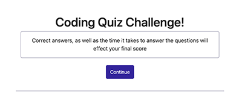
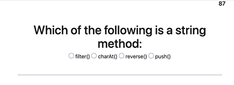
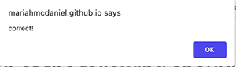
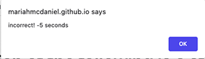
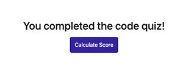
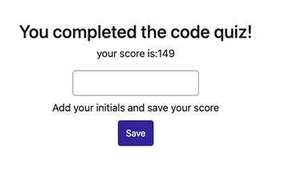
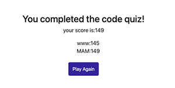

# timed-code-quiz

## Table of Contents
- [Description](#Description)
- [Usage](#Usage)
- [Visuals](#Visuals)

## Description
- [Click here to access my coding quiz](https://mariahmcdaniel.github.io/timed-code-quiz/)

For this project, my goal was to create a timed coding quiz that incorporates the amount of time taken to complete the quiz, as well as correct or incorrect aswers, into the score. Additionally, I wanted users to be able to save their initials along with their score.

## Usage

When you navigate to my [code quiz](https://mariahmcdaniel.github.io/timed-code-quiz/), you will see the welcome message and a continue button. When you click the continue button, you will be presented with the first question. After reading the question, click the radio button or label of the answer you would like to select, then repeat this process for the proceeding questions. For each question, you will be awarded 20 points if your chosen answer was correct, and you will lose 5 seconds on the timer if you answer was incorrect. After all of the questions have been answered, you will see a message indicating that you have completed the coding quiz. When you click the calculate score button, your score will be displayed on the screen along with an input box where you can save your initials and your score. Once you press save, you will be presented with a play again button. If you click "play again" the quiz will restart and the timer will be reset.

## Visuals

Welcome message with continue button

First question 

Alerts for correct, incorrect answers

 

Completed quiz message

Type your initials and save your score

High-Scores list with play again button

